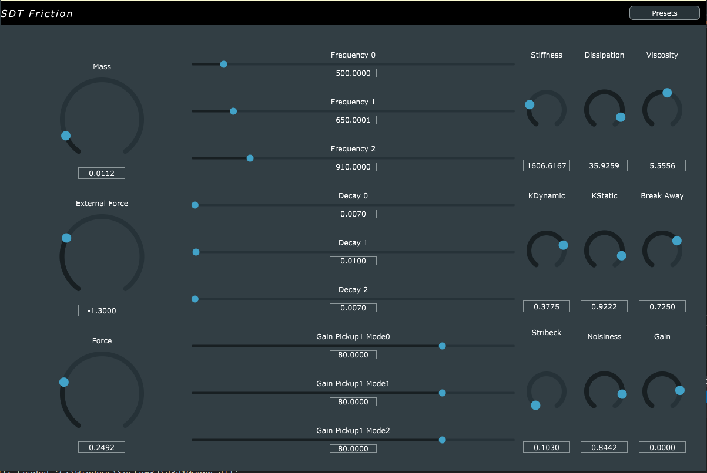
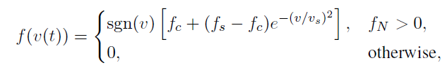
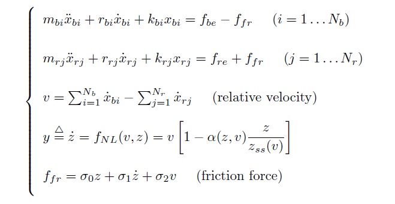
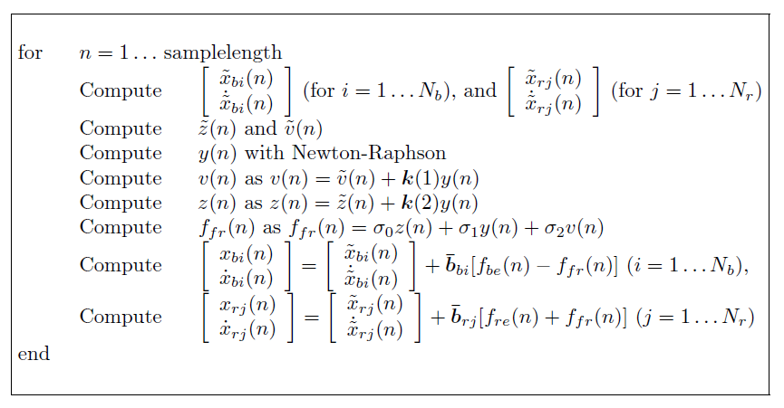
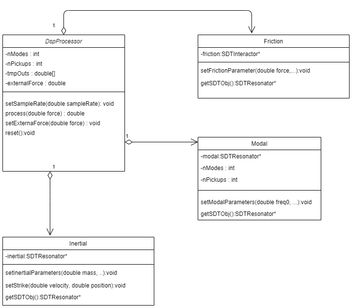
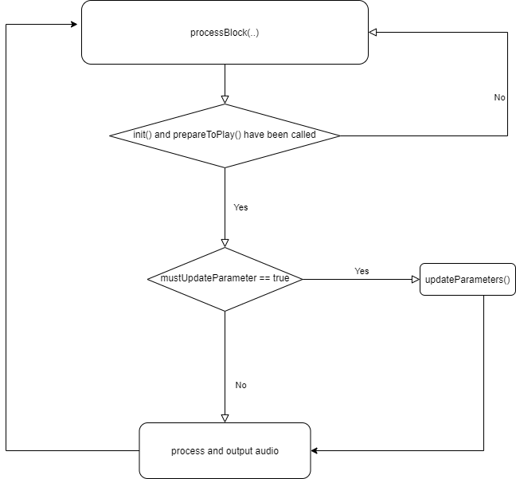

# Sound Design Toolkit - Friction Model VST3 Plugin
<!-- omit in toc -->
### A plugin realization of the friction model from the [Sound Design Toolkit](http://www.soundobject.org/SDT/) created with [JUCE](https://juce.com/)
<!-- omit in toc -->

<!-- omit in toc -->
## Contents
- [Introduction](#introduction)
- [Friction Model](#crumpling-model)
    - [Description](#description)
    - [Synthesis Algorithm](#synthesis-algorithm)
- [Friction Model Plugin](#impact-model-plugin)
    - [Software Architecture](#software-architecture)
- [References](#references)
 
## Introduction
The Sound Design Toolkit consists in a library of ecologically founded (e.g physics based) sound synthesis algorithms.

In this project the entire SDT library is ported in C++ and integrated in the JUCE framework for the realization of a VST3 plugin version of the impact model.

## Friction Model

The Friction model is the second of the basic solid interaction models implemented by the Sound Design Toolkit. 

### Description
The model implemented is a kinetic model (as the friction force is assumed to be a function of velocity only).A possible parametrization of the kinetic friction force model is :

where fc, fs are the Coulomb force and the stiction force, respectively, while vs is usually referred to as Stribeck velocity.

The model implemented describes continuous contact (friction) between two modal resonators. One of the the objects is considered to be a rigid “bow”, i.e. an
inertial mass described with one mode, zero spring constant and zero internal damping. The other object is a “rigid wall”, i.e. a modal object with an ideally infinite mass. For clarity, we denote the two objects with the subscripts “b” and “r”, which stand for “bow” and “resonator”, respectively.

The two objects interact through the elasto-plastic friction force. Thus, the continuous-time equations are:

where the x is modal displacements, while z is the mean bristle displacement. The terms fbe, fre represent external forces, while the integers Nb and Nr are the number of modes for the bow and the resonator, respectively. Explicit expressions for alpha and zss are available from the literature.

### Synthesis Algorithm

The final sound is the total displacement of the system. The synthesis algorithm is the following

## Friction model Plugin

The friction model plugin was implemented by taking as a reference the sdt.friction Max/Msp patch from the Sound Design Toolkit.

In this particular realization of the impact model there are two resonators, they expose one or more pickup points, object displacement and velocity can be read at any time from these pickup points. The two resonators implemented in this impact model are:

- Inertial mass: Simulates a simple inertial point mass, i. e. the hammer resonator mostly used as exciter for modal resonators;
- Modal resonator: Physical model of a set of parallel mass–spring–damper mechanical oscillators, with each oscillator representing a resonant frequency of the object.
Interactor algorithms read the state of exactly two pickup points, one for each interacting resonator, and apply a force accordingly.

### Software Architecture

The SDT library is ported in C++ through the creation of a series of class wrappers, this to preserve modularity. The DSP audio processing has been separated from the resonators and interactors methods, in this way we have a template to use for all the SDT class wrappers. The audio processing in the DspProcess class is a sample-by-sample processing, the creation of the buffer is delegated to the processBlock method of the PluginProcessor class. The software architecture is the following:

The final audio processing is realized by the processBlock method of the Pluginprocessor class, this method is called in the main audio thread of the plugin. To connect the user parameters, that can be changed in the GUI, in a safe way a real time audio processing logic is implemented in the plugin :

The parameters are stored in atomic lock-free variables so to prevent the use of mutex or other techniques that could block the main thread.

